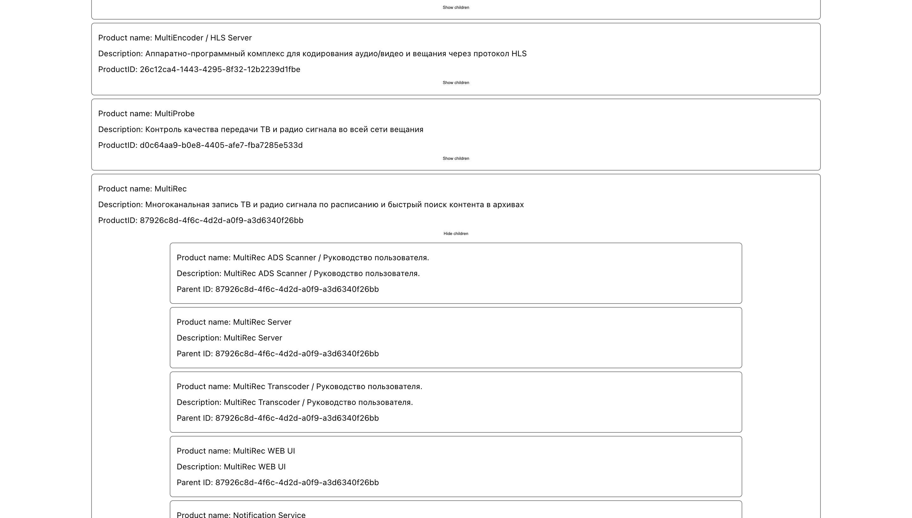
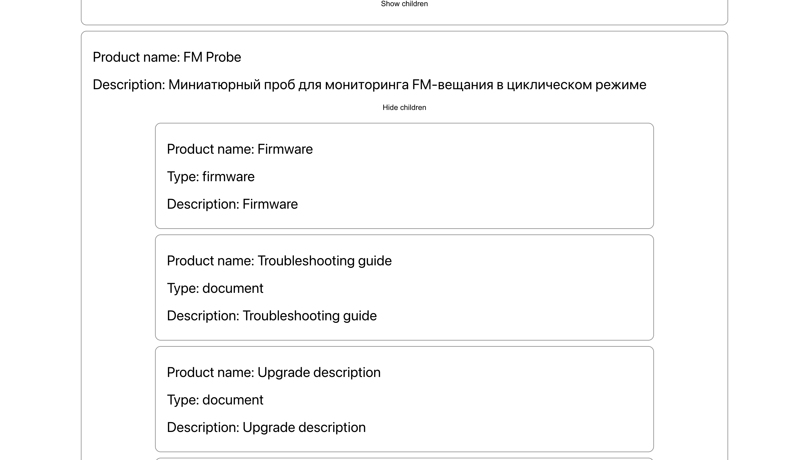

#Это тестовое задание в StreamLabs

###Как выглядит(Показ ID включен для наглядности в итоговой версии этого нет)

###Конечный вариант строго по заданию

#Само задание(ссылку на api я скрыл)
Необходимо создать web-страницу, которая отвечает следующим требованиям:

Каждый отдельный продукт компании отображается в виде карточки.
Карточка содержит: название продукта, его описание и кнопку либо иконку "Развернуть/Свернуть".
При клике на кнопку/иконку карточка разворачивается, и отображает список всех под-продуктов, относящихся к данному продукту.
Список под-продуктов должен содержать название, тип и описание под-продукта.

Для реализации можно использовать любые сторонние библиотеки. Использование React.js не обязательно, но будет засчитано как плюс.

API:

Запрос, который возвращает список продуктов и под-продуктов в формате JSON: https://google.com.

Запрос возвращает стандартный JSON объект.

Описание полей:

ProductID: Уникальный идентификатор продукта.

Name: Название продукта.

Type: Тип продукта.

descriptionen: Описание продукта.

isDeleted: Маркер того, что продукт удален. Удаленные продукты отображать на странице не нужно.

ParentID: Нужен, чтобы отделить продукт от под-продукта. У продукта равен null. У под-продукта равен "ProductID" родительского продукта.

Пример зависимости продукт и под-продукт:

Name: "Молочные продукты",

ProductID: 1,

ParentID: null

Name: "Творог",

ProductID: 2,

ParentID: 1
